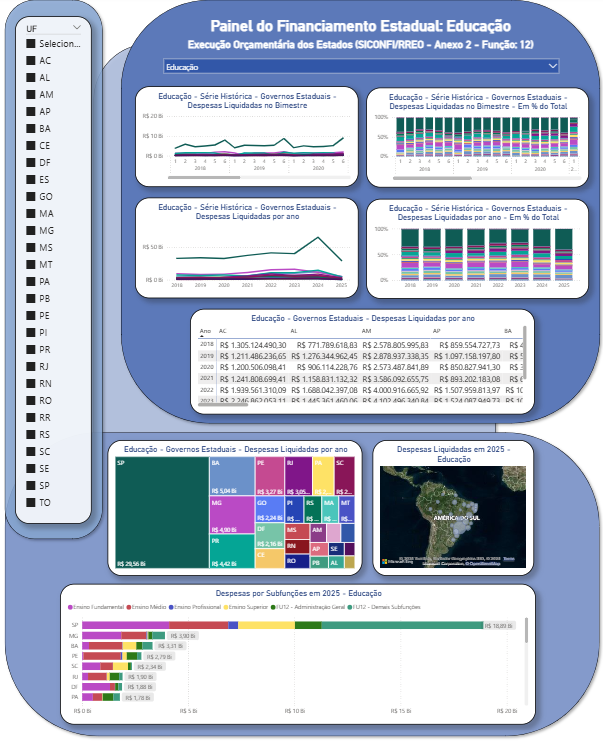
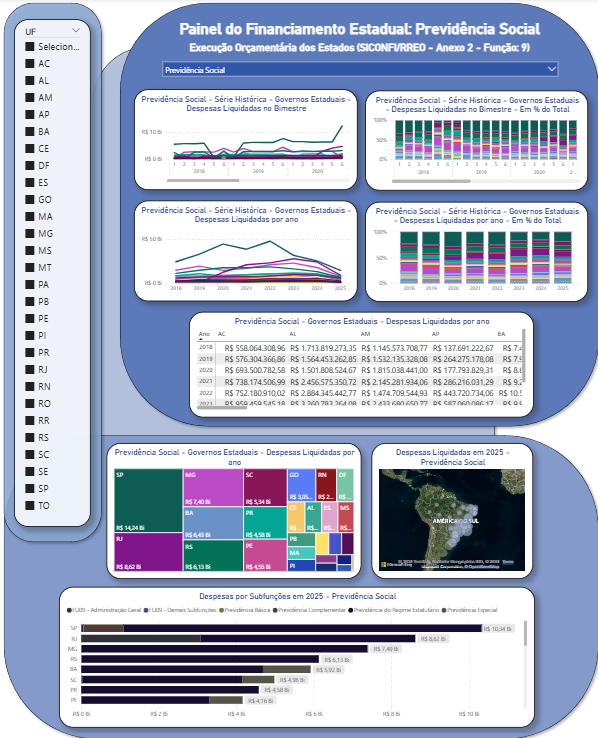

# Painel RREO – Todas as Funções do MTO (Anexo 2 Completo)

Este repositório disponibiliza um **dashboard interativo em Power BI** para análise detalhada das **despesas liquidadas dos Governos Estaduais**, extraídas diretamente da **API do Tesouro Transparente (SICONFI)** por meio do endpoint `rreo` (Anexo 2).  
O painel cobre **integralmente as 28 funções orçamentárias definidas pelo Manual Técnico de Orçamento (MTO)**, com detalhamento de **todas as subfunções** de cada uma delas. É possível selecionar qualquer função para análise, bem como filtrar por ente federativo.

---

## Dashboard

<p align="center">
  
  <br>
  <em>Figura 1 – Painel interativo em Power BI mostrando despesas liquidadas com a função 12 (Educação) por estado.</em>
</p>

<p align="center">
  
  <br>
  <em>Figura 2 – Painel interativo em Power BI mostrando despesas liquidadas com a função 10 (Saúde) por estado.</em>
</p>

<p align="center">
  
  <br>
  <em>Figura 3 – Painel interativo em Power BI mostrando despesas liquidadas com a função 9 (Previdência Social) por estado.</em>
</p>

---

## Escopo dos Dados

- O painel considera **apenas despesas liquidadas** (`coluna = "DESPESAS LIQUIDADAS NO BIMESTRE"`).
- **Despesas intra-orçamentárias foram excluídas.**
- Estão presentes **todas as 28 funções do MTO**, incluindo suas subfunções, conforme classificação vigente.
- A análise é possível por ente federativo (estados) e por qualquer função, permitindo visualização comparativa, temporal e geográfica.
- Nenhum filtro é aplicado na extração: o painel contempla o **Anexo 2 completo** do RREO, para todos os entes e bimestres disponíveis desde 2018 até o ano atual.

---

## Lista das Funções (MTO 2026)

O painel cobre as seguintes funções orçamentárias, cada uma discriminando suas subfunções conforme a tabela do MTO:

| Código |           Função Orçamentária           |
|:------:|:---------------------------------------:|
|  01    |            Legislativa                  |
|  02    |            Judiciária                   |
|  03    |         Essencial à Justiça             |
|  04    |           Administração                 |
|  05    |         Segurança Pública               |
|  06    |          Defesa Nacional                |
|  07    |        Relações Exteriores              |
|  08    |         Assistência Social              |
|  09    |         Previdência Social              |
|  10    |               Saúde                     |
|  11    |              Trabalho                   |
|  12    |              Educação                   |
|  13    |               Cultura                   |
|  14    |       Direitos da Cidadania             |
|  15    |              Urbanismo                  |
|  16    |              Habitação                  |
|  17    |              Saneamento                 |
|  18    |         Gestão Ambiental                |
|  19    |       Ciência e Tecnologia              |
|  20    |            Agricultura                  |
|  21    |        Organização Agrária              |
|  22    |              Indústria                  |
|  23    |       Comércio e Serviços               |
|  24    |           Comunicações                  |
|  25    |               Energia                   |
|  26    |             Transporte                  |
|  27    |         Desporto e Lazer                |
|  28    |        Encargos Especiais               |

Cada função detalha suas subfunções específicas, que podem ser selecionadas diretamente no dashboard para análise individualizada.

---

## Coleta de Dados

### **Despesas Públicas (SICONFI)**

O dashboard é alimentado por um **arquivo bruto extraído via script R (`DoFile.R`)**, que coleta todas as informações do **Anexo 2 do endpoint `rreo`** (API Tesouro Nacional).

- **Endpoint:** `rreo`
- **Parâmetros utilizados na coleta:**
  - `id_ente`: Código IBGE do estado (ex.: 33 = Rio de Janeiro)
  - `an_exercicio`: Anos de 2015 até o atual
  - `nr_periodo`: Bimestres (1 a 6)
  - `co_tipo_demonstrativo`: `RREO` (Relatório Resumido da Execução Orçamentária)
  - `no_anexo`: `RREO-Anexo 02`

> O script **não filtra por função ou subfunção na coleta**, capturando todo o Anexo 2. Os filtros temáticos são aplicados **diretamente no Power BI**, onde é possível selecionar funções, subfunções e entes de interesse.

### **Script utilizado: `DoFile.R`**

O script percorre todos os anos, bimestres e estados para montar uma base consolidada e completa do Anexo 2 do RREO.

---

## Estrutura do Projeto

```text
SICONFI-API-POWERBI/
│
├── data/                              # armazenamento de dados brutos
│   └── raw/                           # dump bruto da API
│       └── siconfi_rreo_bruto_2015_2025.zip
│
├── docs/                              # documentação e recursos visuais
│   ├── images/                        # capturas de tela dos dashboards
│   │   ├── demo_f09.png
│   │   ├── demo_f10.png
│   │   └── demo_f12.png
│   └── data_dictionary.md             # dicionário de dados do projeto
│
├── src/                               # scripts de extração de dados
│   └── DoFile.R                       # coleta registros brutos do RREO Anexo 2
│
├── .gitignore
├── Dashboard RREO – Anexo 2.pbix
└── README.md
